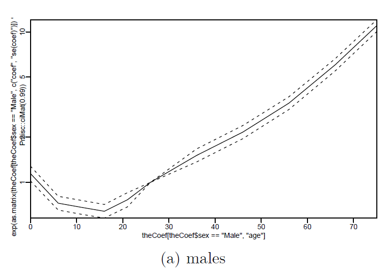

```{r setup, include=FALSE}
knitr::opts_chunk$set(echo = FALSE,eval=FALSE, warning = FALSE,message=FALSE)
```


# Introduction

It is known that men have more accidents than women. It is claimed that the proportion of fatal accidents for men is higher than the proportion of fatal accidents for women which means men are more often invovled with fatal accidents that women did. This fact may be partly due to the reason that women are less likely to 
walk outdoors late at night or in bad weather than men. This may also due to the reason that men are more likely to do risky behaviours on average than women. 

Under the above background, this study aims to assess whether the findings  are consistent with the assumptions based on UK road accident data. There are lots of questions of interest, they  are that:

1). whether women tends to be safer than men as pedestrians especially for teenagers in early adulthood as well?

2). whether age effect is the same for women and men in risk of fatal accidents?

3). whether there is a trend of being safer for both women and men in past recent years? 

4). whether there is a month effect for women and men in a year that there is high number of fatal accidents than other months?


The goal of the study is try to apply statistical models to answer the question of interest based on the UK road accident data.

The study is organized as below, an introduction is first given followed by data description and models introduction, at last, results and discussions are given to answer the questions of interest. The study could be found on the GitHub repo: https://github.com/LiyuanCao2020/final.


# Data

The source data comes from the UK road accident data. UK road accident data, the data source link is  https://www.gov.uk/government/collections/road-accidents-and-safety-statistics. It is a survey data on road accidents collected by the Department for Transport in UK.

And the survey data includes statistics and data about reported accidents and casualties on public roads in Great Britain. It contains accidents factor or slight as well as light conditions, weather conditions and basic characteristics such as age, sex for men and women who are involved in the accidents. Also, there is attribute indicate fatal accidents as well as number of killed in the accidents which are considered to be fatal accidents.

The target population of the survey data is the whole road accidents in UK, the frame population is a list of records collected by the Department for Transport in UK, so there is possible some cases can not be sampled which introdue a non-response bias due to reasons like missing recorded, incorrectly recorded or even non=recorded. The samples are road accidents. To draw the samples collected, samplimg method cluster sampling is used that it collects road accidents clustered by roads. 

Due to the samples can not be real-time, so it can not actually record all of cases, but this would not change our study too much as the conditions of roads in close regions would be very similar that road accidents sampled already in the samples are highly representive for the samples in the population.


# Models 

The models used in this study is a logistic model and conditional logit model as well as mixed effects model.
For the logistic model, we aims to use it make an initial investigation of relations among variables in the data. It is selected as the interpretion is very easy, and the response is a binary data, probit model is harder to interpret, other models would be not appropriate for response with 2 levels. The model is:


$$logit(probability(accident = fatal)) = \beta X + \epsilon$$


where accident is fatal or not,  the response is a binary outcome, the covariates are gender, light conditions, weather conditions. For the conditional logistic model, we combine the conditions into a strata and then perform the logistic model. For the model considering random effect, a poisson model is selected as the response now becomes a county data the number of factal accidents now, so poisson model is most appropraite. The model is:

$$Y_i \sim Poisson(\lambda_i)$$

$$log(\lambda_i) = \beta X  + Z_i$$

$$Z_i \sim N(0, \sigma^2_z)$$


* $Y_i$ is number of factal accidents at time i 

* X is month

* $Z_i$ is random effect of time.

The prior distribution is:

$$ \sigma_Z^2 \sim exp(x), pr(Z > 0.001) = 0.5$$


Note, the prior distribution is given in a relative risk form that it means the probability of z > 0.001 is 0.5 so the median of z is 0.001. 


# Results

```{r}

library(lubridate)
library(Pmisc)
library(dplyr)
library(INLA)
library(knitr)
library(survival)
library(mapmisc)

pedestrainFile = downloadIfOld("http://pbrown.ca/teaching/appliedstats/data/pedestrians.rds")
pedestrians = readRDS(pedestrainFile)
pedestrians = pedestrians %>% filter(!is.na(time)) %>% 
  mutate(
y =  Casualty_Severity == "Fatal",
timeCat = format(time, "%Y_%b_%a_h%H"),
strata = paste(Light_Conditions,Weather_Conditions, timeCat)
    
)


d1 <- table(pedestrians$strata, pedestrians$y)
print(d1)


d2 = rownames(d1)[which(d1[, 1] == 0 | d1[, 2] == 0)]


x = pedestrians[!pedestrians$strata %in% d2, ]


res = rbind(as.data.frame(summary(theClogit)$coef), `age 26 - 35` = c(0, 1, 0, NA, NA))
res$sex = c("Male", "Female")[1 + grepl("Female", rownames(res))]


res <- res %>% mutate(age =  as.numeric(gsub("age|Over| - [[:digit:]].*|[:].*",
"", rownames(res)))) %>% arrange(sex, age)


d3 <- res[res$sex == "Male", "age"]

d4 <- as.matrix(res[res$sex == "Male", c("coef", "se(coef)")])
                

matplot(d3, exp(d4) %*% ciMat(0.99),log = "y", type = "l", col = "black", 
        lty = c(1, 2, 2), xaxs = "i", yaxs = "i")


d3 <- res[res$sex == "Female", "age"]

d4 <- as.matrix(res[res$sex == "Female", c("coef", "se(coef)")])
                

matplot(d3, exp(d4) %*% ciMat(0.99),log = "y", type = "l", col = "black", 
        lty = c(1, 2, 2), xaxs = "i", yaxs = "i")

model1 <- glm(y ~ sex + age + Light_Conditions + Weather_Conditions,
data = x, family = "binomial")

knitr::kable( summary(model1)$coef[1:4, ])


model2 = clogit(y ~ age + age:sex + strata(strata), data = x)

summary(model2)
```

__Figure 1. Odds Ratio of chance of fatal accidents vs. non-fatal accidents with increasing of age for males__



Figure 1 shows the Odds Ratio of chance of fatal accidents vs. non-fatal accidents with increasing of age for males, clearly, the figure shows after about 20 years old, with increasing of age. there is a quick rise up trend that the odds ratio of chance of fatal accidents increasing along with age, it means more risk of fatal accidents for older males.


__Figure 2. Odds Ratio of chance of fatal accidents vs. non-fatal accidents with increasing of age for females__


Figure 2 shows similar results that the Odds Ratio of chance of fatal accidents vs. non-fatal accidents with increasing of age for females, unlikely with males, the figure shows after about 30 years old, with increasing of age. there is a slow rise up trend that the odds ratio of chance of fatal accidents increasing along with age, it means more risk of fatal accidents for older females but the trend not increase such fast as males. Also, there is a decline trend for females before 30 years old. However, the estimates here are little larger than that of males.


__Table 1. Estimations of effects of sex and ages by logistic model__

|Variable |Estimate |Std. Error|z value |Pr(>|z|)|
|:---|---:|---:|---:|---:|
|(Intercept)| -3.2507678| 0.02370768| -137.118754| 0.000000e+00|
|sexFemale| -0.2988120 |0.01245826 |-23.985048| 3.983187e-127|
|age0 - 5| 0.1124659| 0.03448000 |3.261772 |1.107180e-03|
|age6 - 10| -0.4369786 |0.03241323 |-13.481489 |2.010085e-41|


Table 1 shows the estimations of effects of sex and ages by logistic model, we can find all of the factors have significant effects on fatal accidents' probability as the p values shown in the table 1 are all much lower than 0.05.


```{r}
dat <- dat %>% mutate(dateInt  =  as.integer(date),
                    month = factor(format(date, "%b"), levels = format(ISOdate(2000,1:12, 1), "%b"))
                      )

model_male = inla(Male ~ 0 + month + f(dateInt, model = "rw2",
prior = "pc.prec", param = c(0.001, 0.5), scale.model = FALSE) +
f(dateIid, model = "iid", prior = "pc.prec", param = c(log(1.1),
0.5)), family = "poisson", data = dat, control.predictor = list(compute = TRUE))
model_female = inla(Female ~ 0 + month + f(dateInt, model = "rw2",
prior = "pc.prec", param = c(0.001, 0.5), scale.model = FALSE) +
f(dateIid, model = "iid", prior = "pc.prec", param = c(log(1.1),
0.5)), family = "poisson", data = dat, control.predictor = list(compute = TRUE))
qCols = paste0(c(0.5, 0.025, 0.975), "quant")
knitr::kable(exp(cbind(model_male$summary.fixed[, qCols], model_female$summary.fixed[,
qCols])), digits = 3)
```


__Table 2. Monthly average number of fatal accidents(someone killed in the accidents) for males__

|month    |  0.5quant|  0.025quant|  0.975quant|
|:--------|---------:|-----------:|-----------:|
|monthJan |     0.651|       0.461|       0.887|
|monthFeb |     0.599|       0.418|       0.826|
|monthMar |     1.192|       0.918|       1.516|
|monthApr |     1.594|       1.264|       1.974|
|monthMay |     2.014|       1.632|       2.448|
|monthJun |     1.987|       1.610|       2.419|
|monthJul |     2.009|       1.630|       2.447|
|monthAug |     2.423|       1.993|       2.909|
|monthSep |     1.722|       1.374|       2.123|
|monthOct |     1.310|       1.014|       1.657|
|monthNov |     1.304|       1.009|       1.651|
|monthDec |     0.670|       0.471|       0.917|


__Table 3. Monthly average number of fatal accidents(someone killed in the accidents) for females__

|month    |  0.5quant.1|  0.025quant.1|  0.975quant.1|
|:--------|-----------:|-------------:|-------------:|
|monthJan |       0.573|         0.380|         0.820|
|monthFeb |       0.662|         0.451|         0.928|
|monthMar |       0.986|         0.720|         1.308|
|monthApr |       1.816|         1.438|         2.255|
|monthMay |       2.176|         1.752|         2.658|
|monthJun |       1.893|         1.504|         2.343|
|monthJul |       2.447|         1.994|         2.962|
|monthAug |       2.968|         2.459|         3.539|
|monthSep |       2.084|         1.668|         2.559|
|monthOct |       1.645|         1.280|         2.067|
|monthNov |       0.951|         0.687|         1.273|
|monthDec |       0.582|         0.383|         0.838|

Tables 2-3 show the Monthly average number of fatal accidents(someone killed in the accidents) for males and females, the figures 3 also show the estimates directly, and we can find that for both males and females, there first shows an increase trend and then after reach the peak about at Aug, there is a decline trend until Dec. 


```{r}
a1 <- priorPostSd(model_male)$summary[, qCols]
a2 <- priorPostSd(model_female)$summary[, qCols]
kable(a1, digits = 6)
kable(a2, digits = 6)
```


__Table 4. Stanard deviations estimated by model for males__

|SD           | 0.5quant| 0.025quant| 0.975quant|
|:-----------|---------:|-----------:|-----------:|
|SDfoateInt  |  0.000009|    0.000004|    0.000019|
|SDfodateIid |  0.148565|    0.061186|    0.296394|


__Table 5. Stanard deviations estimated by model for females__

|SD           | 0.5quant.1| 0.025quant.1| 0.975quant.1|
|:-----------|-----------:|-------------:|-------------:|
|SDfoateInt  |    0.000007|      0.000002|       0.00002|
|SDfodateIid |    0.127425|      0.040304|       0.27259|


Tables 4-5 show the standard deviations estimated for the random effects of time, it can be found the time's random effects is clearly large for both males and females.

```{r}

matplot(dat$date, exp(model_male$summary.random$dateInt[,
qCols]), type = "l", lty = c(1, 2, 2), col = "black",
log = "y", ylim = c(0.18, 5.8), yaxs = "i", lwd = c(2,
1, 1), xlab = "", ylab = "", xaxs = "i")

matlines(dat$date, exp(model_female$summary.random$dateInt[,
qCols]), type = "l", lty = c(1, 2, 2), col =  col2html("red",
0.6), lwd = c(2, 1, 1))
matplot(exp(model_male$summary.fixed[, qCols]), type = "l", lty = c(1,
2, 2), col = "black", log = "y", ylim = c(0.35, 3.9),
yaxs = "i", lwd = c(2, 1, 1), xlab = "", ylab = "",
xaxs = "i", xaxt = "n")
axis(1, 1:nlevels(dat$month), levels(dat$month),
las = 3)
matlines(exp(model_female$summary.fixed[, qCols]), lty = c(1, 2,
2), col = col2html("red", 0.6), lwd = c(2,
1, 1))
```


__Figure 3. Monthly average number of fatal accidents(someone killed in the accidents) for both males and females__


__Figure 4. Yearly trends of average number of fatal accidents(someone killed in the accidents) for both males and females in the history about 40 years__


Figure 4 shows the yearly trends of average number of fatal accidents(someone killed in the accidents) for both males and females in the history about 40 years, clearly, there is a decline trend along with the years.


# Discussion


As it is shown by figure 1 that with increasing of age after 20 years old for males, the risk of fatal accidents is also increasing very fast, and for females in figure 2, the change point age becomes 30 years old and after 30 years old for females, the risk is increasing very slowly compated with that for males. For example, when males is 70 years old, the odds ratio becomes close to 10, it means for each additional age, there would be about 10 times in odds of fatal accidents vs. non-fatal accidents while for males with age 20 years old, there is only about 0.5 times increase in odds of fatal accidents vs. non-fatal accident for each additional age.  For females, when females is 70 years old, the odds ratio is only aboutu 0.9, it means for each additional age, there would be about 0.9 times in odds of fatal accidents vs. non-fatal accidents while for females with age 30 years old, there is  about 0.6 times increase in odds of fatal accidents vs. non-fatal accident for each additional age, thus, the differences in males and females is huge, the chance of fatal accidients is totally different between males and females with different ages.

The findings in figure 1 is also verified by table 1 which shows the estimations of effects of sex and ages by logistic model as we can find all of the factors have significant effects on probability of fatal accidents because the p values are all much lower than 0.05.

Figure 3 and Tables 2-3 show the Monthly average number of fatal accidents(someone killed in the accidents) for males and females, we can find there are similar patterns for both males and females, there is an increase trend with month increase and then there is a decline trend with month increase, and the peak happens at Aug. Tables 4-5 show the standard deviations estimated for the random effects of time, we find the time's random effects is clearly large for both males and females, thus, random effects can not be ignored.

At last, figure 4 shows the yearly trends of average number of fatal accidents(someone killed in the accidents) for both males and females in the history about 40 years, we find there is a clear decline trend.


So the findings mainly figure out that the risks of fatal accidents are indeed much different for males and females and the females have a lower risk of fatal accidents in average compared with males, however, this relation is also changed a lot based on the ages of males and females, this finding is very important, because we find for females, the older females such as females with 70 years old and the young females such as females with 30 years old actually do not differ much in risk of fatal accidents, but for males, for a male with 70 years old there is about 10 times of risk of fatal accidents compared with young ones. This is very important for government to know, because with this finding, the government could make better decisions in protecting older people especially older males from factal road accidents.

However, for young females such as ages from 0 to 10 years old, the risk of factal accidents is higher in females compared with males, so this finding is also important that besides taking care of older males, we also need to pay attention to young females. 

Also, for months, we find months around Aug have shown highest average number of factal accidents(someone killed in the accidents) while in Jan, Feb, Nov ande Dec, the average numbers are very low which about only 1/5 of peak's one at Aug.

So combine the above findings,  although the road is more safer with increasing of time in recent years, we suggest the goverment do their best in protecting people especially in Aug and pay more attention to young females and old males by methods such as force drivers to drive under a lower limit speed.


Besides the findings above, there are weaknesses in this study. First, this study limits to the road situations in UK and might not be generalized to the whole world or any other country as we only observed UK's fatal accidents data, the difference situations in different countries are different, Second, the data is a database records reported in several periods, so there is a weakness that the report might be biasd due to the facts that some records might be mis-recorded or just no responses, thus there would be sampling bias. Third, for control covariates, we might need more useful covariates to avoid introducing omitted variable bias. Thus, as there are weakness and limitations of the study, in future work, we want to try our best to deal with issues. For the ist issue, we can find more data such as the world wide survey data. For the second issue, we can perform a more carefully survey to reduce non-response biasness or related biasness, At last, for the 3rd issue, we can consider a range of more important covariates such as type of vechles, size of vechles and so on to reduce the omitted variable biasness.


# References

 
1. Garrett Grolemund, Hadley Wickham (2011). Dates and Times Made Easy with lubridate. Journal of
  Statistical Software, 40(3), 1-25. URL http://www.jstatsoft.org/v40/i03/.
  
  
2. Hadley Wickham, Romain Fran<U+00E7>ois, Lionel Henry and Kirill Müller (2019). dplyr: A Grammar of Data
  Manipulation. R package version 0.8.3. https://CRAN.R-project.org/package=dplyr
  
  
3. Patrick Brown (2020). Pmisc: Various Utilities for knitr and inla. R package version 0.3.2/r2380.
  https://R-Forge.R-project.org/projects/diseasemapping/
  

4. R Core Team (2019). R: A language and environment for statistical computing. R Foundation for
  Statistical Computing, Vienna, Austria. URL https://www.R-project.org/

5. Rrown PE (2016). "Maps, coordinate reference systems and visualising geographic data with mapmisc."
_R-journal_, *8*(1), 64-91. <URL: https://journal.r-project.org/archive/2016-1/brown.pdf>.


6.  Therneau T (2020). _A Package for Survival Analysis in R_. R package version 3.2-3, <URL:
https://CRAN.R-project.org/package=survival>.

  
7.  Yihui Xie (2015) Dynamic Documents with R and knitr. 2nd edition. Chapman and Hall/CRC. ISBN
  978-1498716963
  


